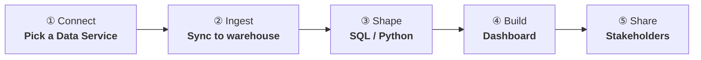
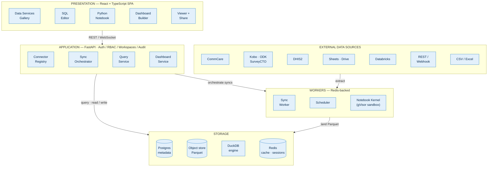
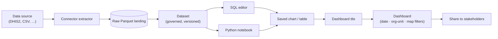
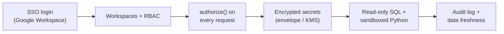

# Unified Solutions Platform — Architecture

> Connect any data source → ingest it → shape it with **SQL or Python** → build a **dashboard** → **share it to stakeholders**.

A presentation-ready, browser version of these diagrams is at
[`docs/architecture.html`](architecture.html) — open it in a browser and use
**Save as PDF** for slides.

---

## 1. The analyst journey

One self-service loop replaces hand-wiring every dashboard. An analyst never
waits on an engineer to onboard a source.

---

## 2. System architecture

**Why these choices** (full rationale in the build plan):
- **FastAPI + Postgres** — async API; Postgres holds *metadata only* (no analytical scans).
- **DuckDB over Parquet** — fast columnar analytics, embeds in the notebook for zero-copy data access; ClickHouse swap-in at scale.
- **Arq workers + scheduler** — manual "Sync now" and cron syncs share one path.
- **gVisor-sandboxed kernels** — run untrusted analyst Python safely (no egress, resource-capped).

---

## 3. Data flow — source to stakeholder

Dashboards bind to **datasets**, never to raw source schemas — so evolving
survey forms never break a dashboard.

---

## 4. Security & governance (cross-cutting)

Every resource is **workspace-scoped**; secrets are envelope-encrypted and never
returned by the API; analyst SQL is read-only and Python runs sandboxed.
